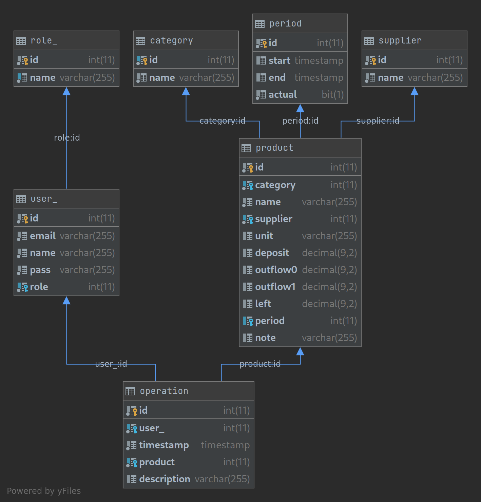

# Almacen
+ Home page: http://localhost/almacen/fe/index.php
+ Rest API with PHP, experimental.
+ Client, simple HTML web template with bootstrap.
## Tested on:
+ OS: Fedora 33 workstation 64bit
+ PHP: 7.4.13 (cli) (built: Nov 24 2020 10:03:34) ( NTS )
+ Mariadb: Ver 15.1 Distrib 10.4.17-MariaDB, for Linux (x86_64) using  EditLine wrapper
## Fedora
Dependencies:
```sudo dnf install php-mysqlnd```

Services:
```bash
sudo systemctl restart httpd.service
sudo systemctl restart mariadb.service
```

Logs:

```error_log("message");```
```bash
sudo tail -F /var/log/httpd/*
sudo tail -F /var/log/php-fpm/www-error.log
```
## DB
mariadb / mysql
### Example config.php
```injectablephp
<?php

class Config
{
	static $host = '172.17.0.2';
	static $db_name = 'almacen';
	static $username  = 'root';
	static $password  = 'root';
}
```
### Database's diagram

### Local
+ host: localhost
+ name: almacen
+ user: root
+ password: root

## Dev notes

### release process:
+ update ```changelog.txt```
+ update ```footer.php```
+ update the db, if needed

## Links
+ https://www.html.it/pag/374031/il-primo-servizio-rest/
+ https://startbootstrap.com/theme/sb-admin-2
+ https://gist.github.com/eric1234/4692807
